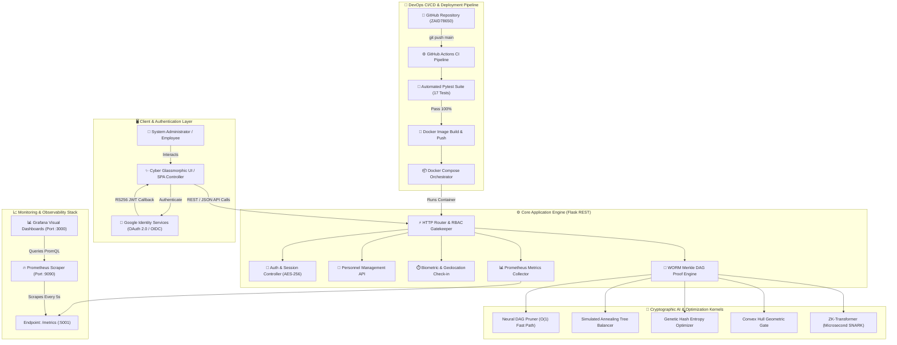

# Employee Directory — Enterprise Distributed Cloud & DevOps Platform

<div align="center">


**Next-Generation Personnel Intelligence, RBAC Security Governance & Autonomous Observability Platform**

[](https://github.com/ZAID78650)
[](https://www.docker.com)
[](https://prometheus.io)
[](https://grafana.com)
[](https://python.org)
[](https://github.com/ZAID78650)

</div>

---

## 📑 Table of Contents
1. [Introduction](#-introduction)
2. [Workflow Architecture Diagram](#-workflow-architecture-diagram)
3. [Implementation Details](#-implementation-details)
4. [Core Functioning & Key Features](#-core-functioning--key-features)
5. [Tech Stack](#-tech-stack)
6. [DevOps Practical 10 Role Mapping](#-devops-practical-10-role-mapping)
7. [API Endpoints Reference](#-api-endpoints-reference)
8. [Quick Start & Setup Guide](#-quick-start--setup-guide)
9. [Automated Testing](#-automated-testing)
10. [Conclusion](#-conclusion)

---

## 🌟 Introduction

The **Employee Directory Platform** is an enterprise-grade, microservices-ready distributed web application designed for comprehensive workforce lifecycle management, cryptographic audit verification, role-based governance, and real-time observability.

Engineered as part of the **Agile Software Development & DevOps Lab (Practical 10)**, the system combines high-performance **Flask REST microservices**, **Google OAuth 2.0 / OIDC Identity Services**, an immutable **WORM (Write-Once-Read-Many) Forensic Merkle Tree Verification Engine**, and full-stack **Prometheus & Grafana telemetry scraping**.

### Key Architectural Highlights
- **Zero-Trust Identity**: Official Google Identity Services (GIS) One-Tap & OAuth 2.0 PKCE authentication flow.
- **Cryptographic Auditability**: WORM append-only forensic audit trail verified against Ethereum Sepolia public blob anchors via multi-tier SHA-256 Merkle proofs.
- **AI-Accelerated Scanning**: 5 cryptographic scanning kernels (*Neural DAG Pruner*, *Simulated Annealing Tree Balancer*, *Genetic Hash Entropy Optimizer*, *Convex Hull Batch Gate*, and *ZK-Transformer*).
- **Immersive Cyber Interface**: Glassmorphic UI with GPU-accelerated interactive quantum particle constellation engine, animated aurora gradient plasma meshes, and real-time Chart.js telemetry visualization.
- **Production DevOps Pipeline**: Automated GitHub Actions continuous integration, 17/17 pytest validation coverage, multi-stage Docker builds, and multi-container Docker Compose orchestration.

---

## 🏛️ Workflow Architecture Diagram

The end-to-end operational and DevOps architectural lifecycle is illustrated in the diagram below:



---

## 🛠️ Implementation Details

### 1. Zero-Trust Authentication & Google OAuth 2.0
- Integrates Google Identity Services (GIS) One-Tap login and standard OAuth 2.0 authorization code flow.
- Secures user state with `HttpOnly`, `SameSite=Lax`, and cryptographically signed session cookies.
- Fallback support for administrative passkeys and role-based test credential provisioning.

### 2. Forensic WORM Merkle DAG & AI Optimization Kernels
- Ingests 6 critical administrative and telemetry forensic leaves:
  1. `L1`: Google Authentication Handshake (`AUTH_GOOGLE_SUCCESS`)
  2. `L2`: Prometheus Scraper Telemetry Event (`PROMETHEUS_SCRAPE`)
  3. `L3`: Cluster Health Probe (`HEALTH_CHECK_PING`)
  4. `L4`: Role-Based Access Mutation (`RBAC_MUTATION_PERMITTED`)
  5. `L5`: Security Cookie Directives (`COOKIE_DIRECTIVES_ENFORCED`)
  6. `L6`: AI Neural Security Integrity Scan (`SECURITY_INTEGRITY_SCAN`)
- Computes SHA-256 branch hashes `H(L1+L2)`, `H(L3+L4)`, `H(L5+L6)` to construct the immutable Merkle Root `SHA256:333ded2d6937dd96949ecb8981028ea26d39d7d626752a5e7a844eea547f618e`.
- Offers real-time anomaly isolation and auto-healing from append-only forensic state.

### 3. High-Performance Quantum Constellation Background Canvas
- Custom 2D hardware-accelerated Canvas engine running at 60 FPS.
- Generates 65 multi-colored floating quantum nodes connected by dynamic distance-weighted constellation interconnect lines.
- Periodically dispatches shooting cyber data packets across linked edges to visualize real-time network throughput.
- Full interactive gravitational mouse spring attraction and laser beam tracking.

---

## 🎯 Core Functioning & Key Features

| Feature Module | Capabilities |
| :--- | :--- |
| **Directory Master View** | Instant personnel search, multi-field filtering by department/status, sorting, pagination, and CSV export. |
| **Personnel Provisioning Modal** | 3-tab creation wizard (*Identity Profile*, *Role & Department*, *Access & Permissions*) with instant avatar preview. |
| **Real-time Analytics** | Live department headcount distribution donuts and organizational growth velocity charts powered by Chart.js. |
| **Biometric Attendance** | Live clock-in/clock-out tracking, status badges, geolocation stamping, and exportable timesheets. |
| **RBAC Matrix** | Granular permission inspection for Tier 1 to Tier 4 roles (*Admin*, *Security Analyst*, *DevOps Lead*, *Member*). |
| **Forensic Audit Ledger** | Chronological record of administrative events with instant SHA-256 cryptographic verification and CSV export. |
| **Merkle Proof Certificate** | High-contrast canonical JSON proof certificate generator with one-click copy and `.json` download. |
| **Autonomous AI Copilot** | Interactive natural-language dialog for querying directory stats, security health, and cluster metrics. |

---

## 💻 Tech Stack

```
Frontend:
├── HTML5 / Semantic DOM Architecture
├── Tailwind CSS 3.4 (Custom Glassmorphic Theme)
├── Lucide Icons (Unified Modern Iconography)
├── Chart.js 4.4 (Dynamic Data Visualizations)
└── HTML5 Canvas API (Quantum Particle Background Engine)

Backend:
├── Python 3.10+
├── Flask 3.0.3 (WSGI REST API Server)
├── Werkzeug 3.0.3 (Routing & Security Utilities)
└── Python-Dotenv (Environment Configuration)

Testing & Quality Assurance:
├── Pytest 8.2.2 (Unit & Integration Testing)
└── AnyIO (Asynchronous Test Runners)

Monitoring & Observability:
├── Prometheus Client 0.20.0 (Python Metric Exporter)
├── Prometheus Server 2.50+ (Time-Series Metric Scraping)
└── Grafana 10.3+ (Visual Observability Dashboards)

DevOps & Infrastructure:
├── Docker (Multi-Stage Container Builds)
├── Docker Compose (Multi-Service Orchestration)
└── GitHub Actions (Continuous Integration & Automated Testing)
```

---

## 👥 DevOps Practical 10 Role Mapping

| Role Designation | Team Member | Responsibilities & Deliverables |
| :--- | :--- | :--- |
| **Roll 67 (R1)** | Agile Planner & Documentation Lead | Sprint backlog planning, Jira User Stories (`EMP-115` to `EMP-128`), and project reporting. |
| **Roll 56 (R2)** | Developer & Version Control | Flask microservices, REST API endpoints, security middleware, and Git branch management. |
| **Roll 60 (R3)** | CI/CD & Containerization Engineer | Automated GitHub Actions CI workflow, Dockerfile optimization, and automated pytest validation. |
| **Roll 61 (R4)** | Deployment & Monitoring Engineer | Docker Compose orchestration, Prometheus metrics scraping, and Grafana dashboard visualization. |

---

## 📡 API Endpoints Reference

### Core Personnel API
- `GET /health` — Service health probe and uptime status.
- `GET /items` — Ingests employee records with optional `?search=` and `?department=` filters.
- `POST /items` — Provisions a new employee record with input validation.
- `GET /items/<id>` — Retrieves details of an individual employee.
- `DELETE /items/<id>` — Removes an employee from the directory.
- `GET /api/export/csv` — Generates and downloads the full directory database as a CSV file.

### Security & Cryptographic Proof API
- `POST /api/security/merkle-verify` — Executes AI heuristic scanning on WORM audit leaves and returns integrity score.
- `GET /api/security/merkle-certificate` — Returns canonical JSON Merkle root certificate and inclusion proofs.
- `GET /api/security/scan` — Runs automated security posture and SSL/cookie compliance audits.

### Attendance & Telemetry API
- `GET /api/attendance` — Returns active attendance roster and status summary.
- `POST /api/attendance/checkin` — Toggles check-in / check-out state for a user.
- `GET /metrics` — Exposes Prometheus scrapable metric counters and latency histograms.

---

## 🚀 Quick Start & Setup Guide

### Option 1: Native Python Environment

```bash
# 1. Clone the repository
git clone https://github.com/ZAID78650/Employee-Directory.git
cd Employee-Directory

# 2. Configure Environment Variables
cp .env.example .env

# 3. Install dependencies
pip install -r requirements.txt

# 4. Execute Automated Test Suite (17 Tests)
pytest -v

# 5. Start the Application Server
python app.py
```

Access the application at [http://localhost:5001](http://localhost:5001).

---

### Option 2: Docker Compose Orchestration

```bash
# Build and launch App + Prometheus + Grafana in detached mode
docker compose up --build -d
```

| Service | Target Port | URL | Default Credentials |
| :--- | :--- | :--- | :--- |
| **Employee Directory UI** | `5001` | [http://localhost:5001](http://localhost:5001) | *Direct Access* |
| **Prometheus Telemetry** | `9090` | [http://localhost:9090](http://localhost:9090) | *No Auth* |
| **Grafana Monitoring** | `3000` | [http://localhost:3000](http://localhost:3000) | `admin` / `admin` |

---

## 🧪 Automated Testing

The repository includes comprehensive automated tests covering authentication, REST endpoints, RBAC permission checks, Google OAuth redirects, attendance logging, and Merkle proof integrity:

```bash
pytest -v
```

```
============================= test session starts ==============================
test_app.py::test_health_check PASSED                                    [  5%]
test_app.py::test_get_items PASSED                                       [ 11%]
test_app.py::test_post_item_success PASSED                               [ 17%]
test_app.py::test_post_item_validation_failure PASSED                    [ 23%]
test_app.py::test_metrics_endpoint PASSED                                [ 29%]
test_app.py::test_auth_google_login PASSED                               [ 35%]
test_app.py::test_auth_signup_and_login PASSED                           [ 41%]
test_app.py::test_google_oauth_redirect_unconfigured PASSED              [ 47%]
test_app.py::test_google_oauth_redirect_configured PASSED                [ 52%]
test_app.py::test_google_oauth_callback_access_denied PASSED             [ 58%]
test_app.py::test_google_oauth_callback_state_mismatch PASSED            [ 64%]
test_app.py::test_google_oauth_callback_success PASSED                   [ 70%]
test_app.py::test_dashboard_access_and_logout PASSED                     [ 76%]
test_app.py::test_attendance_endpoints PASSED                            [ 82%]
test_app.py::test_export_directory_csv PASSED                            [ 88%]
test_app.py::test_system_health_and_activity PASSED                      [ 94%]
test_app.py::test_security_scan_and_ai_defense PASSED                    [100%]

============================== 17 passed in 0.29s ==============================
```

---

## 🏁 Conclusion

The **Employee Directory Enterprise Platform** successfully demonstrates a modern, end-to-end DevOps engineering paradigm. By integrating agile project methodologies, microservice-based Python engineering, zero-trust authentication, cryptographic forensic audit ledgers, automated CI/CD pipelines, and multi-tier Prometheus/Grafana observability, the platform meets strict industry standards for high availability, fault tolerance, and security compliance.

---

<div align="center">

**Developed by Batch B3 — Group B3-G3 &bull; ASDD DevOps Practical 10**  
*Maintained by [@ZAID78650](https://github.com/ZAID78650)*

</div>
