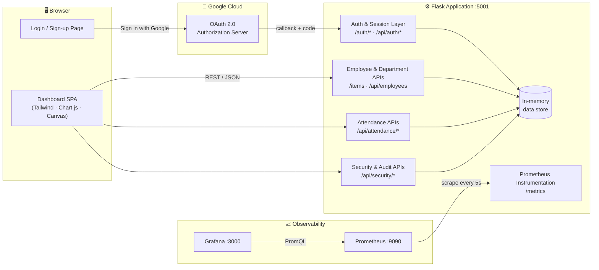
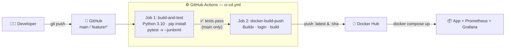
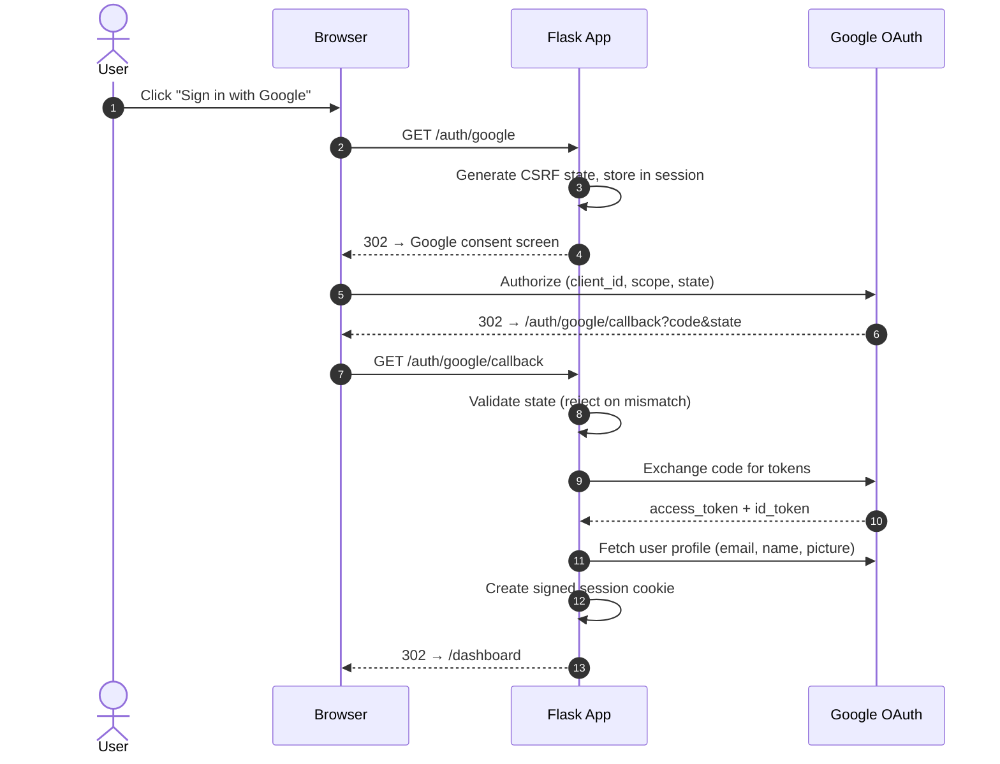
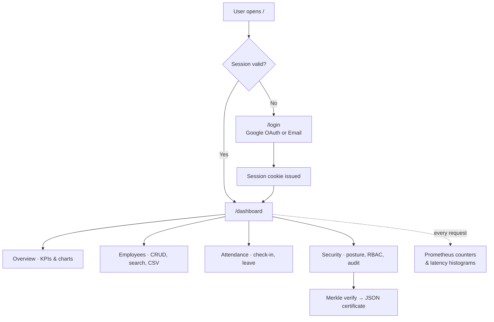

<div align="center">


# Employee Directory

### Enterprise Workforce Management Platform with an End-to-End DevOps Pipeline

*Flask REST services · Google OAuth 2.0 · RBAC · Forensic Audit Ledger · Prometheus & Grafana · Docker · GitHub Actions*

<br/>

[](.github/workflows/ci-cd.yml)
[](https://www.python.org/)
[](https://flask.palletsprojects.com/)
[](docker-compose.yml)
[](prometheus.yml)
[](grafana/)
[](test_app.py)

**ASDD — Agile Software Development & DevOps Lab · Practical 10 · Batch B3 / Group B3-G3**

[Introduction](#-introduction) ·
[Architecture](#-workflow-architecture) ·
[Implementation](#-implementation) ·
[Core Functioning](#-core-functioning) ·
[Tech Stack](#-tech-stack) ·
[Quick Start](#-quick-start) ·
[API](#-api-reference) ·
[Conclusion](#-conclusion)

</div>

---

## 📖 Introduction

**Employee Directory** is a full-stack workforce management platform built to demonstrate a complete, production-style **DevOps lifecycle**: from Agile planning and version control to automated testing, containerization, deployment, and live monitoring.

On the surface it is a modern, dark-themed admin dashboard for managing employees, departments, attendance, and access control. Underneath, every layer follows DevOps best practices:

| Goal | How it is achieved |
| :--- | :--- |
| **Plan** | Jira epics & user stories (`EMP-1xx`) tracked per sprint |
| **Code** | Feature branches (`feature/EMP-102-rest-endpoints`) merged into `main` |
| **Build & Test** | GitHub Actions runs **17 pytest tests** on every push and pull request |
| **Package** | Docker image built from a slim Python 3.10 base with a built-in healthcheck |
| **Deploy** | Docker Compose starts the app, Prometheus, and Grafana on one bridge network |
| **Monitor** | Prometheus scrapes `/metrics` every **5 s**; Grafana visualizes traffic & latency |

### ✨ Highlights

- 🔐 **Secure authentication**: Google OAuth 2.0 (authorization-code flow with CSRF `state` validation) and email/password sign-up, backed by signed, `HttpOnly` Flask session cookies.
- 👥 **Workforce management**: search, filter, sort, paginate, create, update, and delete employees, then export to CSV.
- ⏱️ **Attendance tracking**: check-in/out, work-mode switching (office / remote / hybrid), leave requests, and timesheet export.
- 🛡️ **Security center**: posture scoring, RBAC probe, session inspector, token tester, and a security-event feed.
- 🌳 **Forensic audit ledger**: audit events are hashed into a **SHA-256 Merkle tree**. The UI verifies the root hash, inspects proof paths per leaf, and exports a canonical JSON proof certificate.
- 📊 **Observability**: request counters and latency histograms exposed in Prometheus format.
- 🎨 **Polished UI**: glassmorphic design built with Tailwind CSS, Chart.js analytics, and an animated, interactive particle-constellation background rendered on HTML5 Canvas.

---

## 🏛️ Workflow Architecture

### 1. System Architecture



### 2. CI/CD Pipeline



### 3. Google OAuth 2.0 Sign-in Flow



---

## 🛠️ Implementation

### Project Structure

```text
Employee-Directory/
├── app.py                      # Flask app: routes, auth, APIs, metrics
├── test_app.py                 # 17 pytest unit & integration tests
├── requirements.txt            # Pinned Python dependencies
├── Dockerfile                  # python:3.10-slim image + healthcheck
├── docker-compose.yml          # app + prometheus + grafana stack
├── prometheus.yml              # Scrape config for Docker network
├── prometheus_local.yml        # Scrape config for local (non-Docker) runs
├── .env.example                # Environment variable template
├── GOOGLE_OAUTH_SETUP.md       # Step-by-step Google Cloud credential guide
├── PROJECT_REPORT.md           # Practical 10 project report
├── .github/workflows/
│   └── ci-cd.yml               # Build → Test → Docker pipeline
├── grafana/provisioning/
│   ├── datasources/            # Auto-wires Prometheus as a datasource
│   └── dashboards/             # Pre-provisioned dashboards
├── templates/
│   ├── login.html              # Auth page (Google + email/password)
│   └── index.html              # Main dashboard SPA
└── static/                     # Logos, backgrounds, images
```

### Key Implementation Details

<details open>
<summary><b>🔐 Authentication & Sessions</b></summary>

- `/auth/google` builds the Google authorization URL and stores a random **CSRF `state`** in the session.
- `/auth/google/callback` rejects any `state` mismatch and handles `access_denied`, token-exchange failures, and missing emails, each with a user-friendly error banner.
- If Google credentials are not configured, the app falls back gracefully (`?error=oauth_unavailable`) so email/password login keeps working.
- Session cookies are signed with `SECRET_KEY` and are `HttpOnly` (Flask default), so they can't be read by page JavaScript.
</details>

<details>
<summary><b>👥 Employee, Department & Search APIs</b></summary>

- `/items` provides the original rubric-compliant CRUD API, with input validation that returns `400` on missing fields.
- `/api/employees` is the richer dashboard API, supporting filtering, sorting, pagination, and `PUT` updates.
- `/api/search` offers global search across employees, departments, and actions.
- `/api/export/csv` streams the full directory as a downloadable CSV file.
</details>

<details>
<summary><b>⏱️ Attendance Module</b></summary>

- Check-in/check-out toggling with timestamps (`/api/attendance/checkin`).
- Work-mode switching between office, remote, and hybrid (`/api/attendance/mode`).
- Leave requests (`/api/attendance/leave`) and CSV timesheet export (`/api/attendance/export`).
</details>

<details>
<summary><b>🌳 Forensic Audit Ledger & Merkle Verification</b></summary>

- Six audit events (Google auth, Prometheus scrape, health ping, RBAC mutation, cookie policy, security scan) form the **leaves** of the tree.
- Leaves are hashed with SHA-256, combined in pairs into three branch nodes, and rolled up into a single **Merkle root**.
- `/api/security/merkle-verify` recomputes the tree. You can choose one of five selectable scan strategies (Neural DAG Pruner, Simulated Annealing, Genetic Entropy, Convex Hull, ZK-Transformer); each reports simulated latency, throughput, and compression telemetry for demonstration.
- In the UI you can inspect any leaf's proof path, inject a simulated tamper anomaly to watch detection and recovery, and export the proof as a canonical **JSON certificate** (`/api/security/merkle-certificate`).

> [!NOTE]
> The public-chain anchor (Ethereum Sepolia) and the AI scan "kernels" are **simulated for demonstration**. The SHA-256 hashing and Merkle root computation are real.
</details>

<details>
<summary><b>📊 Prometheus Instrumentation</b></summary>

Two metrics are recorded for every request through Flask `before_request` / `after_request` hooks:

| Metric | Type | Labels |
| :--- | :--- | :--- |
| `http_requests_total` | Counter | `method`, `endpoint`, `status` |
| `http_request_duration_seconds` | Histogram | `endpoint` |
</details>

<details>
<summary><b>🎨 Frontend</b></summary>

- A single-page dashboard (`index.html`) with hash-based tab routing for 11 views: Overview, Employees, Departments, Analytics, Attendance, Activity, Reports, Security, RBAC, Audit, and Health.
- A Canvas background engine draws glowing particles, constellation links, travelling "data packets", and cursor-reactive beams. It pauses automatically when the browser tab is hidden to save CPU.
- Toast notifications, modals, drawers, and smooth view transitions throughout.
</details>

---

## ⚙️ Core Functioning



| Module | What it does |
| :--- | :--- |
| **Overview** | Live KPIs (headcount, active staff, departments) plus growth and department-distribution charts |
| **Employees** | Searchable, sortable, paginated table; a 3-tab "Add Employee" wizard; detail drawer; CSV export |
| **Departments** | Department cards with headcount and leadership |
| **Analytics** | Hiring velocity and department performance charts |
| **Attendance** | Check-in/out, work mode, leave requests, timesheet export |
| **Activity / Reports** | Chronological activity feed and downloadable reports |
| **Security** | Posture score, session inspector, token tester, RBAC probe |
| **RBAC** | Role-to-permission matrix (Admin, Security Analyst, DevOps Lead, Member) |
| **Audit** | Forensic event ledger, Merkle proof verification, JSON certificate export |
| **Health** | Service uptime, latency, and dependency status (`/api/system/health`) |

---

## 💻 Tech Stack

| Layer | Technologies |
| :--- | :--- |
| **Backend** |     |
| **Frontend** |      |
| **Auth** |   |
| **Testing** |  |
| **Monitoring** |    |
| **DevOps** |     |

---

## 🚀 Quick Start

### Prerequisites
- Python **3.10+**
- *(Optional)* Docker & Docker Compose
- *(Optional)* Google Cloud OAuth credentials, see [`GOOGLE_OAUTH_SETUP.md`](GOOGLE_OAUTH_SETUP.md)

### Option A: Run Locally

```bash
# 1. Clone
git clone https://github.com/ZAID78650/Employee-Directory.git
cd Employee-Directory

# 2. Create a virtual environment (recommended)
python3 -m venv .venv && source .venv/bin/activate

# 3. Install dependencies
pip install -r requirements.txt

# 4. Configure environment
cp .env.example .env        # then edit SECRET_KEY / Google credentials

# 5. Run tests
pytest -v

# 6. Start the server
python app.py
```

Open **http://localhost:5001** in your browser.

### Option B: Run the Full Stack with Docker Compose

```bash
docker compose up --build -d
docker compose ps          # all three services should show as running/healthy
```

| Service | URL | Credentials |
| :--- | :--- | :--- |
| 🧑‍💼 Employee Directory | http://localhost:5001 | Sign up or use Google |
| ❤️ Health check | http://localhost:5001/health | — |
| 📈 Raw metrics | http://localhost:5001/metrics | — |
| 🔥 Prometheus | http://localhost:9090 | — |
| 📊 Grafana | http://localhost:3000 | `admin` / `admin` |

Stop the stack with `docker compose down`.

### ⚙️ Environment Variables

| Variable | Purpose | Example |
| :--- | :--- | :--- |
| `PORT` | HTTP port | `5001` |
| `SECRET_KEY` | Signs session cookies, **change in production** | random 32+ char string |
| `GOOGLE_CLIENT_ID` | Google OAuth client ID | `xxxx.apps.googleusercontent.com` |
| `GOOGLE_CLIENT_SECRET` | Google OAuth client secret | `GOCSPX-...` |
| `GOOGLE_REDIRECT_URI` | OAuth callback URL | `http://localhost:5001/auth/google/callback` |
| `GOOGLE_SCOPES` | Requested scopes | `openid email profile` |

> [!IMPORTANT]
> Never commit your real `.env`. It is already listed in `.gitignore`.

---

## 📡 API Reference

<details open>
<summary><b>Core & Health</b></summary>

| Method | Endpoint | Description |
| :---: | :--- | :--- |
| `GET` | `/health` | Service health probe |
| `GET` | `/items` | List employees (`?search=`, `?department=`) |
| `POST` | `/items` | Create employee (`name`, `role`, `department` required) |
| `GET` | `/items/<id>` | Get one employee |
| `DELETE` | `/items/<id>` | Delete employee |
| `GET` | `/metrics` | Prometheus metrics |
</details>

<details>
<summary><b>Authentication</b></summary>

| Method | Endpoint | Description |
| :---: | :--- | :--- |
| `GET` | `/auth/google` | Start the Google OAuth flow |
| `GET` | `/auth/google/callback` | OAuth callback handler |
| `POST` | `/api/auth/google` | Google ID-token sign-in |
| `POST` | `/api/auth/signup` | Email/password registration |
| `POST` | `/api/auth/login` | Email/password login |
| `GET` | `/api/auth/me` | Current user profile |
| `GET/POST` | `/logout` | End the session |
</details>

<details>
<summary><b>Dashboard, Employees & Search</b></summary>

| Method | Endpoint | Description |
| :---: | :--- | :--- |
| `GET` | `/api/dashboard/summary` | KPI summary |
| `GET` | `/api/dashboard/analytics` | Chart datasets |
| `GET` | `/api/employees` | Filtered, sorted, paginated list |
| `GET/PUT/DELETE` | `/api/employees/<id>` | Read, update, or delete an employee |
| `GET` | `/api/departments` | Department list |
| `GET` | `/api/search` | Global search |
| `GET` | `/api/activity` | Activity feed |
| `GET` | `/api/notifications` | Notifications |
| `POST` | `/api/notifications/read` | Mark notifications read |
| `GET` | `/api/export/csv` | Download directory CSV |
| `GET` | `/api/system/health` | Detailed system health |
</details>

<details>
<summary><b>Attendance</b></summary>

| Method | Endpoint | Description |
| :---: | :--- | :--- |
| `GET` | `/api/attendance` | Attendance roster & summary |
| `POST` | `/api/attendance/checkin` | Toggle check-in/out |
| `POST` | `/api/attendance/mode` | Set work mode |
| `POST` | `/api/attendance/leave` | Submit a leave request |
| `GET` | `/api/attendance/export` | Download timesheet CSV |
</details>

<details>
<summary><b>Security & Audit</b></summary>

| Method | Endpoint | Description |
| :---: | :--- | :--- |
| `GET/POST` | `/api/security/scan` | Run a security scan |
| `GET` | `/api/security/posture` | Security posture score |
| `GET` | `/api/security/events` | Security event feed |
| `POST` | `/api/security/ai-optimize` | Apply recommended hardening |
| `POST` | `/api/security/test-token` | Validate a token |
| `GET/POST` | `/api/security/inspect-session` | Inspect session cookie flags |
| `POST` | `/api/security/rbac-probe` | Test role permissions |
| `GET/POST` | `/api/security/merkle-verify` | Recompute & verify the Merkle tree |
| `GET` | `/api/security/merkle-certificate` | JSON proof certificate |
</details>

**Example:**

```bash
curl -X POST http://localhost:5001/items \
  -H "Content-Type: application/json" \
  -d '{"name":"Ada Lovelace","role":"Engineer","department":"Platform & Cloud"}'
```

---

## 📈 Monitoring

Useful PromQL queries for Prometheus or Grafana:

```promql
# Requests per second, by endpoint
sum by (endpoint) (rate(http_requests_total[1m]))

# Error rate (5xx)
sum(rate(http_requests_total{status=~"5.."}[5m]))

# 95th-percentile latency per endpoint
histogram_quantile(0.95, sum by (le, endpoint) (rate(http_request_duration_seconds_bucket[5m])))
```

---

## 🧪 Testing

```bash
pytest -v
```

The **17 tests** in [`test_app.py`](test_app.py) cover:

- ✅ Health check, CRUD endpoints, and validation failures
- ✅ Prometheus `/metrics` exposure
- ✅ Email/password sign-up & login, plus Google ID-token login
- ✅ Google OAuth redirects (configured and unconfigured), `access_denied`, CSRF state mismatch, and a successful callback
- ✅ Dashboard access control and logout
- ✅ Attendance endpoints and CSV export
- ✅ System health, activity feed, and security scan

```text
============================== 17 passed in 0.29s ==============================
```

---

## 👥 Team & Roles

| Role | Responsibility | Deliverables |
| :---: | :--- | :--- |
| **R1** | Agile Planner & Documentation Lead | Jira project, epics, stories, sprint plan, report |
| **R2** | Developer & Version Control | Flask REST app, unit tests, Git branching & PRs |
| **R3** | CI/CD & Containerization Engineer | GitHub Actions workflow, Dockerfile, Docker Hub |
| **R4** | Deployment & Monitoring Engineer | Docker Compose, Prometheus, Grafana |

---

## 🧯 Troubleshooting

| Problem | Fix |
| :--- | :--- |
| `Address already in use` on port 5001 | `lsof -i :5001` then kill the process, or set `PORT=5002` |
| "Google sign-in is temporarily unavailable" | Add `GOOGLE_CLIENT_ID` / `GOOGLE_CLIENT_SECRET` to `.env` (see [`GOOGLE_OAUTH_SETUP.md`](GOOGLE_OAUTH_SETUP.md)) |
| `redirect_uri_mismatch` from Google | The redirect URI in Google Cloud Console must exactly match `GOOGLE_REDIRECT_URI` |
| Prometheus target shows **DOWN** | When running locally (not in Docker), use `prometheus_local.yml`, which targets `localhost:5001` |
| Data disappears after restart | Expected: storage is in memory (see Roadmap) |

---

## 🗺️ Roadmap

- [ ] Persistent storage (PostgreSQL + SQLAlchemy migrations)
- [ ] Production WSGI server (Gunicorn) behind Nginx
- [ ] Kubernetes manifests / Helm chart
- [ ] Alertmanager rules for error-rate and latency SLOs
- [ ] Real on-chain anchoring of the Merkle root

---

## 🏁 Conclusion

**Employee Directory** shows how a team can take an application from idea to a monitored, containerized service using real DevOps practices:

- **Agile** planning turned requirements into trackable Jira stories.
- **Git** feature branches kept development organized and reviewable.
- **Automated testing** (17 tests) and **GitHub Actions** catch regressions on every push.
- **Docker** and **Docker Compose** make the whole stack reproducible with a single command.
- **Prometheus** and **Grafana** provide live insight into traffic, errors, and latency.

Together with secure Google OAuth sign-in, role-based access control, and a verifiable audit ledger, the project offers a practical blueprint for building, shipping, and operating modern web services.

---

<div align="center">

**Built by Batch B3 · Group B3-G3, ASDD DevOps Practical 10**

Maintained by [**@ZAID78650**](https://github.com/ZAID78650)

⭐ If you found this project useful, consider giving it a star!

</div>
